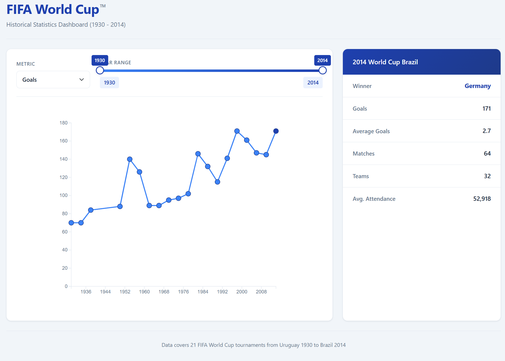

# FIFA World Cup - All Time Statistics Dashboard

An interactive data visualization dashboard exploring 84 years of FIFA World Cup history (1930-2014). Built with D3.js for dynamic charting and Bootstrap for responsive layout.



## Table of Contents

- [Features](#features)
- [Demo](#demo)
- [Installation](#installation)
- [Usage](#usage)
- [Project Structure](#project-structure)
- [Data Format](#data-format)
- [Technologies](#technologies)
- [Browser Support](#browser-support)
- [Contributing](#contributing)
- [License](#license)

## Features

### Interactive Line Chart
- Visualize trends across 21 World Cup tournaments
- Smooth animated transitions when data updates
- Click on data points to view detailed statistics

### Metric Selection
Choose from five different metrics to analyze:
| Metric | Description |
|--------|-------------|
| Goals | Total goals scored in the tournament |
| Average Goals | Goals per match |
| Matches | Total matches played |
| Teams | Number of participating nations |
| Average Attendance | Average spectators per match |

### Year Range Filter
- Dual-handle slider to filter by year range
- Real-time chart updates as you adjust the range
- Covers tournaments from 1930 (Uruguay) to 2014 (Brazil)

### Detail Panel
- Displays comprehensive stats for selected tournament
- Shows host country, winner, and all metrics
- Auto-updates when clicking chart points

## Demo

1. Open `index.html` in a browser
2. Select a metric from the dropdown (e.g., "Goals")
3. Adjust the year slider to focus on a specific era
4. Click any data point to see full tournament details

## Installation

No build process required. Simply clone and open:

```bash
git clone https://github.com/yourusername/FIFA-World-Cup.git
cd FIFA-World-Cup
```

Then open `index.html` in your browser, or use a local server:

```bash
# Python 3
python -m http.server 8000

# Node.js (with http-server installed)
npx http-server
```

Visit `http://localhost:8000` in your browser.

## Usage

### Basic Interaction

```
1. Load the dashboard in your browser
2. Use the dropdown to select a metric
3. Drag slider handles to filter years
4. Click data points for details
```

### Customization

**Change chart dimensions** - Edit constants in `js/main.js`:
```javascript
const CHART_WIDTH = 600;
const CHART_HEIGHT = 500;
const MARGIN = { top: 40, right: 40, bottom: 60, left: 60 };
```

**Modify colors** - Update the COLORS object:
```javascript
const COLORS = {
  line: "#86ac86",
  circle: "#5c865b",
  circleSelected: "black",
  circleStroke: "black"
};
```

**Add new data** - Append rows to `data/fifa-world-cup.csv` following the existing format.

## Project Structure

```
FIFA-World-Cup/
├── index.html              # Main HTML page
├── css/
│   └── style.css           # Custom styles (typography, chart, slider)
├── js/
│   └── main.js             # D3.js visualization logic
├── data/
│   └── fifa-world-cup.csv  # Historical tournament data
├── .gitignore              # Git ignore rules
└── README.md               # This file
```

## Data Format

The CSV file contains the following columns:

| Column | Type | Description |
|--------|------|-------------|
| EDITION | String | Official tournament name |
| YEAR | Integer | Tournament year |
| LOCATION | String | Host country |
| WINNER | String | Winning nation |
| TEAMS | Integer | Number of participating teams |
| MATCHES | Integer | Total matches played |
| GOALS | Integer | Total goals scored |
| AVERAGE_GOALS | Float | Goals per match |
| AVERAGE_ATTENDANCE | Integer | Average spectators per match |

### Sample Data

```csv
EDITION,YEAR,LOCATION,WINNER,TEAMS,MATCHES,GOALS,AVERAGE_GOALS,AVERAGE_ATTENDANCE
2014 FIFA World Cup Brazil,2014,Brazil,Germany,32,64,171,2.7,52918
1930 FIFA World Cup Uruguay,1930,Uruguay,Uruguay,13,18,70,3.9,32808
```

## Technologies

| Technology | Version | Purpose |
|------------|---------|---------|
| [D3.js](https://d3js.org/) | v7 | Data visualization and DOM manipulation |
| [Bootstrap](https://getbootstrap.com/) | 5.2.1 | Responsive grid layout and UI components |
| [noUiSlider](https://refreshless.com/nouislider/) | 15.4.0 | Year range slider with dual handles |

All libraries are loaded via CDN - no local dependencies required.

## Browser Support

Tested and working on:
- Chrome (latest)
- Firefox (latest)
- Safari (latest)
- Edge (latest)

Requires JavaScript enabled and ES6+ support.

## Contributing

1. Fork the repository
2. Create a feature branch (`git checkout -b feature/new-metric`)
3. Commit your changes (`git commit -m 'Add new metric'`)
4. Push to the branch (`git push origin feature/new-metric`)
5. Open a Pull Request

### Ideas for Contributions

- Add responsive chart sizing for mobile devices
- Implement hover tooltips on data points
- Add data for World Cups after 2014
- Create additional chart types (bar chart, pie chart)
- Add country flag icons to the detail panel

## License

This project is for educational purposes only and is not affiliated with FIFA or any official organization.

---

**Data Source:** Historical FIFA World Cup statistics (1930-2014)
